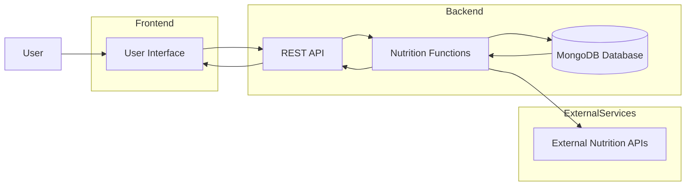

# Technical Architecture

## Overview

The Nutrition Assistant is a full-stack web application designed to help users maintain a healthy lifestyle by providing personalized nutrition recommendations, meal planning, calorie tracking, and food analysis. The application follows a client-server architecture where the frontend communicates with the backend through REST APIs, and the backend manages business logic, database operations, and external API integrations.

---

## System Components

### 1. User Interface (Frontend)

The frontend provides an interactive interface for users to access the application's features.

**Responsibilities:**
- User Registration and Login
- Dashboard
- Meal Planning
- Food Search
- Calorie Tracking
- Nutrition Reports
- Profile Management

**Technologies:**
- HTML5
- CSS3
- JavaScript
- Bootstrap
- React.js

---

### 2. Backend Services

The backend processes user requests, handles business logic, and communicates with the database and external services.

**Responsibilities:**
- User Authentication
- User Management
- Nutrition Recommendation Engine
- Meal Planning
- Food Data Management
- Calorie Calculation
- REST API Development

**Technologies:**
- Node.js
- Express.js

---

### 3. Database

The database stores all application-related information securely.

**Stored Data:**
- User Details
- Login Credentials
- Food Items
- Nutritional Information
- Meal Records
- Daily Calorie Intake
- User Goals

**Technology:**
- MongoDB

---

### 4. External Services

The application can integrate with third-party APIs to fetch nutrition and food information.

**Examples:**
- Edamam API
- Spoonacular API
- USDA FoodData Central API

---

## System Workflow

1. The user accesses the Nutrition Assistant through the web interface.
2. The frontend sends requests to the backend using REST APIs.
3. The backend validates the request.
4. Required data is retrieved from MongoDB.
5. If necessary, the backend communicates with external nutrition APIs.
6. The backend returns the processed data to the frontend.
7. The frontend displays the results to the user.

---

## Technology Stack

| Layer | Technology |
|--------|------------|
| Frontend | HTML, CSS, JavaScript, Bootstrap, React.js |
| Backend | Node.js, Express.js |
| Database | MongoDB |
| API | REST API |
| Authentication | JWT |
| Version Control | Git & GitHub |

---

## Security Features

- JWT Authentication
- Password Encryption using bcrypt
- Input Validation
- Secure REST API Communication
- Protected Database Access

---

## Benefits

- Modular Architecture
- Easy Maintenance
- Scalable Design
- Secure Authentication
- Fast Client-Server Communication
- Easy Integration with External APIs

## Technical Architecture Diagram

